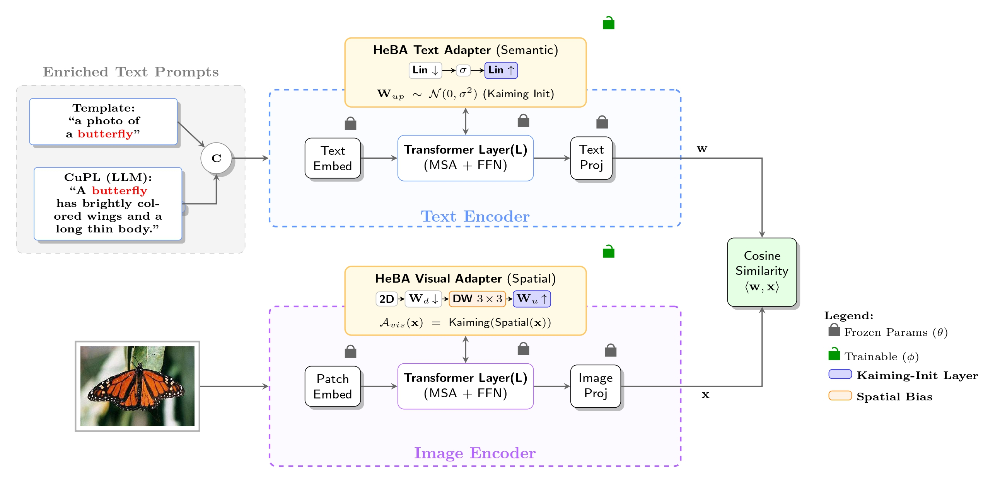

# VLM-HeBA
Heterogeneous Bottleneck Adapters for Robust Vision-Language Models

## [**HeBA: Heterogeneous Bottleneck Adapters for Robust Vision-Language Models**]()<br>
[Md Jahidul Islam](mailto:2006123@eee.buet.ac.bd)<br>
Bangladesh University of Engineering and Technology (BUET)<br>

## Highlights



> **<p align="justify"> Abstract:** Adapting large-scale Vision-Language Models (VLMs) like CLIP to downstream tasks often suffers from a "one-size-fits-all" architectural approach, where visual and textual tokens are processed uniformly by wide, generic adapters. We argue that this homogeneity ignores the distinct structural nature of the modalities—spatial locality in images versus semantic density in text. To address this, we propose \textbf{HeBA} (Heterogeneous Bottleneck Adapter), a unified architectural framework that introduces modality-specific structural inductive biases. HeBA departs from conventional designs through three key architectural innovations: (1) \textbf{Heterogeneity:} It processes visual tokens via 2D depthwise-separable convolutions to preserve spatial correlations, while distinctively processing text tokens via dense linear projections to capture semantic relationships; (2) \textbf{Bottleneck Regularization:} Unlike standard expanding adapters, HeBA employs a compression bottleneck ($D \rightarrow D/4$) that explicitly forces the model to learn compact, robust features and acts as a structural regularizer; and (3) \textbf{Active Gradient Initialization:} We challenge the restrictive zero-initialization paradigm, utilizing a Kaiming initialization strategy that ensures sufficient initial gradient flow to accelerate convergence without compromising the frozen backbone's pre-trained knowledge. Extensive experiments demonstrate that HeBA's architecturally specialized design achieves superior stability and accuracy, establishing a new state-of-the-art on 11 few-shot benchmarks.</p>

## Contributions

- We propose **HeBA**, a heterogeneous framework that decouples inductive biases, enforcing 2D spatial locality for vision via depthwise convolutions and semantic globalism for text via linear projections . <p></p>
- We introduce **Structural Regularization** via a compressive bottleneck architecture ($D \rightarrow D/4$), which naturally filters task-irrelevant noise and prevents overfitting without complex external regularizers . <p></p>
- We challenge the "Zero-Initialization" consensus by implementing a **Forced Kaiming Initialization** ("Hot Start") strategy, which aggressively drives feature adaptation from the first iteration and prevents optimization stagnation .

## All Results over Three Benchmarks
Results reported below are average accuracy across 3 evaluated test settings. **HeBA** achieves the best overall performance, particularly in Base-to-Novel generalization.

| Method | Base2New (HM) | Cross-Datasets | Domain Generalization | Avg |
| -----: | :-----------: | :------------: | :-------------------: | :-: |
| [CLIP](https://arxiv.org/abs/2103.00020)       | 71.70 | 65.15 | 57.18 | 64.67
| [CoOp](https://arxiv.org/abs/2109.01134)       | 71.66 | 63.88 | 59.28 | 64.94
| [CoCoOp](https://arxiv.org/abs/2203.05557)     | 75.83 | 65.74 | 59.91 | 67.16
| [MaPLe](https://arxiv.org/abs/2210.03117)      | 78.55 | 66.30 | 60.27 | 68.37
| [PromptSRC](https://arxiv.org/pdf/2307.06948) | 79.97 | 65.81 | 60.65 | 68.81
| [HPT](https://arxiv.org/pdf/2312.06323)        | 80.23 | 67.74 | 60.71 | 69.56
| [MMA](https://arxiv.org/abs/2311.17043)        | 79.87 | 66.61 | 60.48 | 68.99
| [LwEIB](https://link.springer.com/article/10.1007/s11263-025-02354-1) | 81.21 | 68.61 | **60.84** | 70.22
| **HeBA (Ours)** | **81.35** | **68.71** | 60.26 | **70.11**
------------------------------------------------------------
<p></p>

**Note:** HeBA achieves the highest Harmonic Mean (HM) of **81.35%** on Base-to-Novel generalization and the highest average accuracy of **68.71%** on Cross-Dataset evaluation. In Domain Generalization, HeBA achieves superior robustness on adversarial examples (ImageNet-A) with **51.36%** accuracy.

## Installation 
This code is built on top of the awesome project - [CoOp](https://github.com/KaiyangZhou/CoOp), so you need to follow its setup steps:

First, you need to install the `dassl` environment - [Dassl.pytorch](https://github.com/KaiyangZhou/Dassl.pytorch). Simply follow the instructions described [here](https://github.com/KaiyangZhou/Dassl.pytorch#installation) to install `dassl` as well as PyTorch. After that, run `pip install -r requirements.txt` under `VLM-HeBA/` to install a few more packages required by [CLIP](https://github.com/openai/CLIP) (this should be done when `dassl` is activated).

Second, you need to follow [DATASETS.md](docs/DATASETS.md) to install the datasets.


## How to Run
```bash
python train.py \
--root data \
--seed 1 \
--trainer HeBA \
--dataset-config-file configs/datasets/oxford_pets.yaml \
--config-file configs/trainers/HeBA/base2new.yaml \
--output-dir output/train_dir \
DATASET.NUM_SHOTS 16 \
DATASET.SUBSAMPLE_CLASSES base \
OPTIM.MAX_EPOCH 30 \
OPTIM.LR 0.0075 \
TRAINER.HeBA.ADAPTER_SCALE_BASE 0.025 \
TRAINER.HeBA.ADAPTER_SCALE_FACTOR 2.25 \
TRAINER.HeBA.NEG_SAMPLING_RATIO 5 \
TRAINER.HeBA.SLOW_FAST_RATIO 0.8 \
DATALOADER.TRAIN_X.BATCH_SIZE 16


##Test on Novel Classes
python train.py \
--root data \
--seed 1 \
--trainer HeBA \
--dataset-config-file configs/datasets/oxford_pets.yaml \
--config-file configs/trainers/HeBA/base2new.yaml \
--output-dir output/test_dir \
--model-dir output/train_dir \
--load-epoch 30 \
--eval-only \
DATASET.NUM_SHOTS 16 \
DATASET.SUBSAMPLE_CLASSES new \
TRAINER.HeBA.ADAPTER_SCALE_NOVEL 0.010 \
TRAINER.HeBA.SLOW_FAST_RATIO 0.8
```
## Citation

If you find this code or research helpful, please consider citing our paper:

```bibtex
@misc{islam2026heba,
  title={HeBA: Heterogeneous Bottleneck Adapters for Robust Vision-Language Models},
  author={Islam, Md Jahidul},
  year={2026},
  eprint={2603.16653},
  archivePrefix={arXiv}
}

````

## Acknowledgements
Our code is based on [Co-CoOp](https://github.com/KaiyangZhou/CoOp), [CoOp](https://github.com/KaiyangZhou/CoOp), [MMA](https://github.com/ZjjConan/VLM-MultiModalAdapter) and [LWEIB](https://github.com/ZjjConan/VLM-LwEIB) repositories. We thank the authors for releasing their codes.
